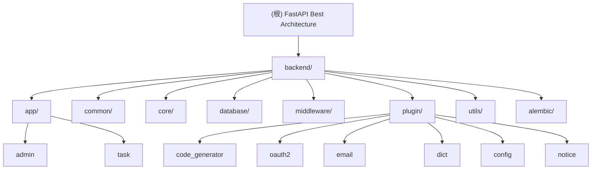

# FastAPI Best Architecture - AI 上下文文档

> 最后更新：2025-12-30 11:02:40 +0800
> 版本：1.12.0
> 语言：Python 3.10+
> 框架：FastAPI

## 变更记录 (Changelog)

### 2025-12-30
- **初始化 AI 上下文文档**：首次生成项目架构文档和模块索引
- **覆盖率**：100% (209 个 Python 文件全部扫描)

---

## 项目愿景

FastAPI Best Architecture (FBA) 是一个**企业级后端架构解决方案**，旨在提供一个开箱即用、最佳实践、高性能、可扩展的 FastAPI 项目模板。

**核心价值：**
- **伪三层架构**：借鉴 Java Spring 的分层思想，适配 Python 生态
- **插件化设计**：核心功能模块化，按需安装和启用
- **生产就绪**：完整的监控、日志、权限、安全机制
- **开发友好**：CLI 工具、代码生成器、完善的文档

---

## 架构总览

### 伪三层架构对照表

FBA 采用伪三层架构设计，与传统 Java Web 架构的对应关系：

| 工作流程     | Java           | FastAPI Best Architecture |
|------------|----------------|---------------------------|
| 视图层      | controller     | api                       |
| 数据传输    | dto            | schema                    |
| 业务逻辑    | service + impl | service                   |
| 数据访问    | dao / mapper   | crud                      |
| 数据模型    | model / entity | model                     |

### 技术栈

**核心框架：**
- **FastAPI** 0.128.0+：现代化高性能 Web 框架
- **SQLAlchemy** 2.0+：ORM 框架，支持异步操作
- **Pydantic** v2：数据验证与序列化
- **Alembic**：数据库迁移工具

**数据存储：**
- **PostgreSQL** 16.0+ / **MySQL** 8.0+：主数据库（二选一）
- **Redis**：缓存、会话、限流、分布式锁

**异步任务：**
- **Celery**：分布式任务队列
- **RabbitMQ** / Redis：消息代理（生产/开发环境）
- **Flower**：Celery 监控界面

**开发工具：**
- **uv**：极速包管理器
- **Ruff**：Python 代码格式化和 Linting
- **Pytest**：单元测试框架

**运维监控：**
- **Docker + Docker Compose**：容器化部署
- **Grafana + Prometheus + Loki + Tempo**：可观测性完整方案
- **OpenTelemetry**：链路追踪

---

## 模块结构图



---

## 模块索引

### 核心应用模块

| 模块名 | 路径 | 职责 | API 路由 | 测试 |
|--------|------|------|----------|------|
| **admin** | [backend/app/admin](./backend/app/admin/CLAUDE.md) | 管理后台核心模块：用户、角色、权限、菜单、部门、数据权限、日志 | `/api/v1/auth`<br>`/api/v1/sys`<br>`/api/v1/log`<br>`/api/v1/monitor` | ✅ |
| **task** | [backend/app/task](./backend/app/task/CLAUDE.md) | Celery 异步任务调度：定时任务、任务结果管理 | `/api/v1/scheduler`<br>`/api/v1/result`<br>`/api/v1/control` | ❌ |

### 插件模块

| 插件名 | 路径 | 职责 | API 路由 |
|--------|------|------|----------|
| **code_generator** | [backend/plugin/code_generator](./backend/plugin/code_generator/CLAUDE.md) | 代码生成：自动生成 CRUD 代码 | `/api/v1/gen` |
| **oauth2** | [backend/plugin/oauth2](./backend/plugin/oauth2/CLAUDE.md) | 第三方登录：GitHub、Google、LinuxDo | `/api/v1/oauth2` |
| **email** | [backend/plugin/email](./backend/plugin/email/CLAUDE.md) | 邮件发送：验证码、通知 | `/api/v1/email` |
| **dict** | [backend/plugin/dict](./backend/plugin/dict/CLAUDE.md) | 数据字典：类型、数据管理 | `/api/v1/sys/dict` |
| **config** | [backend/plugin/config](./backend/plugin/config/CLAUDE.md) | 系统配置：动态配置管理 | `/api/v1/sys/config` |
| **notice** | [backend/plugin/notice](./backend/plugin/notice/CLAUDE.md) | 系统通知：公告、消息 | `/api/v1/sys/notice` |

### 基础设施模块

| 模块名 | 路径 | 职责 |
|--------|------|------|
| **common** | backend/common/ | 通用组件：响应、异常、日志、安全、Socket.IO、分页、Prometheus |
| **core** | backend/core/ | 核心配置：全局配置、路径配置、应用注册器 |
| **database** | backend/database/ | 数据库层：SQLAlchemy 引擎、会话、Redis 客户端 |
| **middleware** | backend/middleware/ | 中间件：JWT 认证、操作日志、访问日志、国际化、状态传递 |
| **utils** | backend/utils/ | 工具函数：加密、雪花算法、时区、正则验证、健康检查等 |
| **alembic** | backend/alembic/ | 数据库迁移：版本控制、自动迁移脚本 |

---

## 运行与开发

### 环境要求

- **Python**：>= 3.10
- **数据库**：PostgreSQL 16.0+ 或 MySQL 8.0+
- **缓存**：Redis 5.0+
- **包管理器**：uv (推荐) 或 pip

### 快速启动

```bash
# 1. 安装依赖（使用 uv）
uv sync

# 2. 自动初始化项目（推荐首次使用）
fba init --auto
# 此命令将：
# - 创建 .env 配置文件
# - 创建数据库
# - 初始化表结构和测试数据

# 3. 启动 API 服务
fba run
# 默认：http://127.0.0.1:8000
# Swagger 文档：http://127.0.0.1:8000/docs
# Redoc 文档：http://127.0.0.1:8000/redoc

# 4. 启动 Celery Worker（可选）
fba celery worker

# 5. 启动 Celery Beat（可选）
fba celery beat

# 6. 启动 Celery Flower（可选）
fba celery flower
```

### FBA CLI 命令

```bash
# 初始化项目
fba init                    # 标准初始化（仅初始化数据库表）
fba init --auto            # 自动化初始化（含环境配置）

# 运行服务
fba run                     # 启动 API 服务
fba run --host 0.0.0.0      # 公网访问
fba run --port 8080         # 自定义端口
fba run --no-reload         # 禁用热重载
fba run --workers 4         # 多进程运行（需配合 --no-reload）

# Celery 服务
fba celery worker           # 启动 Worker
fba celery beat             # 启动 Beat
fba celery flower           # 启动 Flower

# 插件管理
fba add --path /path/to/plugin.zip      # 安装 ZIP 插件
fba add --repo-url https://github.com/... # 安装 Git 插件

# 代码生成（需安装 code_generator 插件）
fba codegen import --app admin --tn users  # 导入数据库表
fba codegen                               # 生成代码

# 执行 SQL 脚本
fba --sql /path/to/script.sql
```

### Docker 部署

```bash
# 启动所有服务（包含 API、数据库、Redis、Celery、监控）
docker-compose up -d

# 仅启动后端服务
docker-compose up -d fba_server fba_postgres fba_redis

# 查看日志
docker-compose logs -f fba_server

# 停止所有服务
docker-compose down
```

---

## 测试策略

### 测试框架

- **Pytest**：主测试框架
- **pytest-sugar**：美化测试输出
- **TestClient**：FastAPI 测试客户端

### 运行测试

```bash
# 运行所有测试
pytest

# 运行指定模块测试
pytest backend/app/admin/tests/

# 运行单个测试文件
pytest backend/app/admin/tests/api_v1/test_auth.py

# 详细输出
pytest -v

# 覆盖率报告
pytest --cov=backend --cov-report=html
```

### 测试数据库

项目使用独立的测试数据库（`fba_test`），测试时自动创建和清理，不影响开发数据库。

配置位置：`backend/app/admin/tests/conftest.py`

---

## 编码规范

### 代码风格

项目使用 **Ruff** 进行代码格式化和 Linting，配置文件：`.ruff.toml`

**核心规则：**
- 行长度：120 字符
- 引号风格：单引号 `'`
- 类型注解：强制要求函数签名注解
- Import 排序：按类型和字母排序
- 异步编程：严格检查异步最佳实践

### Pre-commit Hooks

项目配置了 pre-commit，提交前自动检查和格式化代码。

```bash
# 安装 pre-commit hooks
pre-commit install

# 手动运行所有 hooks
pre-commit run --all-files
```

**已配置 Hooks：**
- `ruff-check`：代码质量检查
- `ruff-format`：代码格式化
- `check-json`、`check-yaml`、`check-toml`：配置文件格式检查
- `end-of-file-fixer`：文件末尾空行修复
- `uv-lock`、`uv-export`：依赖锁定和导出

### 命名约定

- **文件名**：小写下划线（snake_case）
- **类名**：大驼峰（PascalCase）
- **函数/变量名**：小写下划线（snake_case）
- **常量**：全大写下划线（UPPER_SNAKE_CASE）
- **私有成员**：前缀单下划线 `_`
- **模块导入**：按标准库、第三方、本地模块分组

---

## AI 使用指引

### 项目特性

1. **异步优先**：所有数据库操作、外部 API 调用均使用 `async/await`
2. **依赖注入**：FastAPI 的依赖注入系统用于数据库会话、认证、权限检查
3. **类型安全**：全面使用 Pydantic v2 进行数据验证和序列化
4. **主键策略**：支持自增 ID 和雪花算法 ID 两种模式（通过配置切换）
5. **数据库兼容**：同时支持 PostgreSQL 和 MySQL

### 代码生成模板

**创建新的 API 端点：**

```python
# 1. Model (backend/app/{app}/model/{feature}.py)
from backend.common.model import Base, id_key
from sqlalchemy.orm import Mapped, mapped_column
import sqlalchemy as sa

class Feature(Base):
    """功能模块表"""
    __tablename__ = 'app_feature'

    id: Mapped[id_key] = mapped_column(init=False)
    name: Mapped[str] = mapped_column(sa.String(64), comment='名称')
    status: Mapped[int] = mapped_column(default=1, comment='状态')

# 2. Schema (backend/app/{app}/schema/{feature}.py)
from pydantic import BaseModel, Field

class FeatureBase(BaseModel):
    name: str = Field(..., max_length=64, description='名称')
    status: int = Field(1, ge=0, le=1, description='状态')

class FeatureCreate(FeatureBase):
    pass

class FeatureUpdate(FeatureBase):
    name: str | None = None
    status: int | None = None

class FeatureSchema(FeatureBase):
    id: int
    created_time: datetime

    model_config = ConfigDict(from_attributes=True)

# 3. CRUD (backend/app/{app}/crud/crud_{feature}.py)
from sqlalchemy_crud_plus import CRUDPlus
from backend.app.{app}.model.{feature} import Feature

class CRUDFeature(CRUDPlus[Feature]):
    pass

crud_feature = CRUDFeature(Feature)

# 4. Service (backend/app/{app}/service/{feature}_service.py)
from backend.database.db import CurrentSession
from backend.app.{app}.crud.crud_{feature} import crud_feature

class FeatureService:
    @staticmethod
    async def get(db: CurrentSession, pk: int) -> Feature:
        return await crud_feature.select_model(db, pk)

    @staticmethod
    async def create(db: CurrentSession, obj: FeatureCreate) -> None:
        await crud_feature.create_model(db, obj)

feature_service = FeatureService()

# 5. API (backend/app/{app}/api/v1/{feature}.py)
from fastapi import APIRouter, Depends
from backend.database.db import CurrentSession
from backend.app.{app}.service.{feature}_service import feature_service
from backend.common.response.response_schema import response_base

router = APIRouter()

@router.get('/{pk}', summary='获取单个功能')
async def get_feature(pk: int, db: CurrentSession):
    data = await feature_service.get(db, pk)
    return response_base.success(data=data)
```

### 常见任务

**添加新的插件：**
1. 在 `backend/plugin/` 创建插件目录
2. 创建 `plugin.toml` 配置文件
3. 按标准结构组织代码（api/model/schema/service/crud）
4. 在插件 `api/router.py` 中注册路由
5. 项目自动扫描并加载插件

**数据库迁移：**
```bash
# 生成迁移脚本
alembic revision --autogenerate -m "description"

# 执行迁移
alembic upgrade head

# 回滚迁移
alembic downgrade -1
```

**添加中间件：**
在 `backend/middleware/` 创建中间件，然后在 `backend/core/registrar.py` 的 `register_middleware()` 中注册。

### 常见问题

**Q: 如何切换数据库类型？**
A: 修改 `.env` 中的 `DATABASE_TYPE` 为 `mysql` 或 `postgresql`，重新运行 `fba init`。

**Q: 如何启用雪花算法主键？**
A: 修改 `.env` 中的 `DATABASE_PK_MODE='snowflake'`，重新初始化数据库。

**Q: 如何禁用某个插件？**
A: 删除 `backend/plugin/{plugin_name}` 目录即可，项目会自动检测。

**Q: 如何自定义日志格式？**
A: 修改 `backend/core/conf.py` 中的 `LOG_FORMAT` 配置。

---

## 目录结构

```
fastapi_best_architecture/
├── .github/                    # GitHub Actions 工作流
├── backend/                    # 后端主目录
│   ├── __init__.py            # 版本号和模型自动导入
│   ├── main.py                # FastAPI 应用入口（自动注册）
│   ├── run.py                 # 开发服务器启动脚本
│   ├── cli.py                 # FBA CLI 工具
│   │
│   ├── alembic/               # 数据库迁移
│   │   ├── versions/          # 迁移版本脚本
│   │   └── env.py             # Alembic 配置
│   │
│   ├── app/                   # 应用模块
│   │   ├── admin/             # 管理后台模块
│   │   │   ├── api/           # API 路由
│   │   │   ├── crud/          # 数据访问层
│   │   │   ├── model/         # 数据模型
│   │   │   ├── schema/        # Pydantic Schema
│   │   │   ├── service/       # 业务逻辑
│   │   │   ├── tests/         # 单元测试
│   │   │   └── utils/         # 工具函数
│   │   │
│   │   ├── task/              # Celery 任务模块
│   │   │   ├── api/
│   │   │   ├── crud/
│   │   │   ├── model/
│   │   │   ├── schema/
│   │   │   ├── service/
│   │   │   ├── tasks/         # Celery 任务定义
│   │   │   ├── celery.py      # Celery 配置
│   │   │   └── database.py    # 任务数据库配置
│   │   │
│   │   └── router.py          # 应用路由聚合
│   │
│   ├── common/                # 通用组件
│   │   ├── exception/         # 异常处理
│   │   ├── response/          # 响应封装
│   │   ├── security/          # 安全认证（JWT、RBAC、权限）
│   │   ├── socketio/          # WebSocket 支持
│   │   ├── prometheus/        # Prometheus 指标
│   │   ├── enums.py           # 枚举定义
│   │   ├── log.py             # 日志配置
│   │   ├── model.py           # ORM 基类
│   │   ├── pagination.py      # 分页
│   │   ├── queue.py           # 队列
│   │   └── ...
│   │
│   ├── core/                  # 核心配置
│   │   ├── conf.py            # 全局配置（Settings）
│   │   ├── path_conf.py       # 路径常量
│   │   └── registrar.py       # 应用注册器
│   │
│   ├── database/              # 数据库层
│   │   ├── db.py              # SQLAlchemy 配置
│   │   └── redis.py           # Redis 客户端
│   │
│   ├── middleware/            # 中间件
│   │   ├── access_middleware.py      # 访问日志
│   │   ├── jwt_auth_middleware.py    # JWT 认证
│   │   ├── opera_log_middleware.py   # 操作日志
│   │   ├── i18n_middleware.py        # 国际化
│   │   └── state_middleware.py       # 状态传递
│   │
│   ├── plugin/                # 插件系统
│   │   ├── code_generator/    # 代码生成插件
│   │   ├── oauth2/            # OAuth2 登录插件
│   │   ├── email/             # 邮件插件
│   │   ├── dict/              # 数据字典插件
│   │   ├── config/            # 系统配置插件
│   │   ├── notice/            # 系统通知插件
│   │   └── tools.py           # 插件工具函数
│   │
│   ├── utils/                 # 工具函数
│   │   ├── encrypt.py         # 加密工具
│   │   ├── snowflake.py       # 雪花算法
│   │   ├── timezone.py        # 时区处理
│   │   ├── trace_id.py        # 请求追踪 ID
│   │   ├── health_check.py    # 健康检查
│   │   ├── file_ops.py        # 文件操作
│   │   └── ...
│   │
│   └── locale/                # 国际化语言包
│       ├── en-US.json
│       └── zh-CN.yml
│
├── deploy/                    # 部署配置
│   └── backend/
│       ├── docker-compose/    # Docker Compose 配置
│       ├── grafana/           # Grafana 配置
│       ├── nginx.conf         # Nginx 配置
│       └── supervisor/        # Supervisor 配置
│
├── sql/                       # SQL 初始化脚本
│   ├── mysql/
│   └── postgresql/
│
├── .env.example               # 环境变量示例
├── .gitignore                 # Git 忽略规则
├── .pre-commit-config.yaml    # Pre-commit 配置
├── .ruff.toml                 # Ruff 配置
├── docker-compose.yml         # Docker Compose 主配置
├── Dockerfile                 # Docker 镜像构建
├── pyproject.toml             # 项目元数据和依赖
├── README.md                  # 项目说明（英文）
├── README.zh-CN.md            # 项目说明（中文）
└── CLAUDE.md                  # 本文档
```

---

## 相关链接

- **官方文档**：https://fastapi-practices.github.io/fastapi_best_architecture_docs/
- **GitHub 仓库**：https://github.com/fastapi-practices/fastapi_best_architecture
- **Discord 社区**：https://discord.com/invite/yNN3wTbVAC
- **FastAPI 官方文档**：https://fastapi.tiangolo.com/
- **SQLAlchemy 2.0 文档**：https://docs.sqlalchemy.org/en/20/
- **Pydantic v2 文档**：https://docs.pydantic.dev/latest/

---

## 下一步建议

当前覆盖率：**100%** ✅

如需深入了解特定模块，请查看对应的模块级 `CLAUDE.md` 文档：
- [backend/app/admin 模块](./backend/app/admin/CLAUDE.md)
- [backend/app/task 模块](./backend/app/task/CLAUDE.md)
- [插件系统](./backend/plugin/code_generator/CLAUDE.md)
